# Nutrifarm Database ERD (Entity Relationship Diagram)

```mermaid
erDiagram
    %% Users and Authentication
    USERS {
        bigint id PK
        string name
        string email UK
        text address
        timestamp email_verified_at
        string password
        string remember_token
        timestamp created_at
        timestamp updated_at
    }
    
    PASSWORD_RESET_TOKENS {
        string email PK
        string token
        timestamp created_at
    }
    
    SESSIONS {
        string id PK
        bigint user_id FK
        string ip_address
        text user_agent
        longtext payload
        int last_activity
    }
    
    PERSONAL_ACCESS_TOKENS {
        bigint id PK
        string tokenable_type
        bigint tokenable_id
        string name
        string token UK
        text abilities
        timestamp last_used_at
        timestamp expires_at
        timestamp created_at
        timestamp updated_at
    }
    
    %% Email Verification
    EMAIL_VERIFICATIONS {
        bigint id PK
        string email
        string verification_code
        boolean is_verified
        timestamp expires_at
        timestamp created_at
        timestamp updated_at
    }
    
    PHONE_VERIFICATIONS {
        bigint id PK
        string phone_number
        string verification_code
        boolean is_verified
        timestamp expires_at
        timestamp created_at
        timestamp updated_at
    }
    
    %% Products and Categories
    PRODUCTS {
        bigint id PK
        string name
        text description
        decimal price
        decimal discount_price
        int stock
        boolean active
        string image
        timestamp created_at
        timestamp updated_at
    }
    
    CATEGORIES {
        bigint id PK
        string name
        timestamp created_at
        timestamp updated_at
    }
    
    CATEGORY_PRODUCT {
        bigint id PK
        bigint product_id FK
        bigint category_id FK
        timestamp created_at
        timestamp updated_at
    }
    
    VARIANTS {
        bigint id PK
        bigint product_id FK
        string name
        string value
        string unit
        string custom_unit
        decimal price
        int stock
        timestamp created_at
        timestamp updated_at
    }
    
    %% Shopping Cart
    CART_ITEMS {
        bigint id PK
        bigint user_id FK
        bigint product_id FK
        bigint variant_id FK
        int quantity
        timestamp created_at
        timestamp updated_at
    }
    
    %% Favorites
    FAVORITES {
        bigint id PK
        bigint user_id FK
        bigint product_id FK
        bigint variant_id FK
        timestamp created_at
        timestamp updated_at
    }
    
    %% Orders and Payments
    ORDERS {
        bigint id PK
        bigint user_id FK
        decimal total
        string status
        string resi
        string shipping_method
        string payment_status
        string cancel_reason
        timestamp created_at
        timestamp updated_at
    }
    
    ORDER_PRODUCT {
        bigint id PK
        bigint order_id FK
        bigint product_id FK
        int quantity
        decimal price
        timestamp created_at
        timestamp updated_at
    }
    
    INVOICES {
        bigint id PK
        string xendit_id UK
        string external_id
        bigint user_id FK
        bigint order_id FK
        string status
        decimal amount
        string invoice_url
        string payer_email
        string description
        string currency
        timestamp expiry_date
        json raw
        timestamp created_at
        timestamp updated_at
    }
    
    %% Messaging System
    MESSAGES {
        bigint id PK
        bigint sender_id FK
        bigint receiver_id FK
        text message
        boolean is_admin
        timestamp created_at
        timestamp updated_at
    }
    
    %% Roles and Permissions
    ROLES {
        bigint id PK
        string name UK
        timestamp created_at
        timestamp updated_at
    }
    
    ROLE_USER {
        bigint id PK
        bigint user_id FK
        bigint role_id FK
        timestamp created_at
        timestamp updated_at
    }
    
    %% Push Notifications
    FCM_TOKENS {
        bigint id PK
        bigint user_id FK
        string token UK
        timestamp created_at
        timestamp updated_at
    }
    
    %% Laravel System Tables
    CACHE {
        string key PK
        mediumtext value
        int expiration
    }
    
    CACHE_LOCKS {
        string key PK
        string owner
        int expiration
    }
    
    JOBS {
        bigint id PK
        string queue
        longtext payload
        tinyint attempts
        int reserved_at
        int available_at
        int created_at
    }
    
    JOB_BATCHES {
        string id PK
        string name
        int total_jobs
        int pending_jobs
        int failed_jobs
        longtext failed_job_ids
        mediumtext options
        int cancelled_at
        int created_at
        int finished_at
    }
    
    FAILED_JOBS {
        bigint id PK
        string uuid UK
        text connection
        text queue
        longtext payload
        longtext exception
        timestamp failed_at
    }
    
    %% Relationships
    USERS ||--o{ SESSIONS : "has"
    USERS ||--o{ CART_ITEMS : "has items in cart"
    USERS ||--o{ ORDERS : "places"
    USERS ||--o{ INVOICES : "receives"
    USERS ||--o{ MESSAGES : "sends as sender"
    USERS ||--o{ MESSAGES : "receives as receiver"
    USERS ||--o{ ROLE_USER : "has roles"
    USERS ||--o{ FCM_TOKENS : "has tokens"
    USERS ||--o{ FAVORITES : "favorites"
    
    PRODUCTS ||--o{ VARIANTS : "has"
    PRODUCTS ||--o{ CATEGORY_PRODUCT : "belongs to categories"
    PRODUCTS ||--o{ CART_ITEMS : "added to cart"
    PRODUCTS ||--o{ ORDER_PRODUCT : "ordered"
    PRODUCTS ||--o{ FAVORITES : "favorited by users"
    
    VARIANTS ||--o{ CART_ITEMS : "selected in cart"
    VARIANTS ||--o{ FAVORITES : "favorited as variant"
    
    CATEGORIES ||--o{ CATEGORY_PRODUCT : "contains products"
    
    ORDERS ||--o{ ORDER_PRODUCT : "contains"
    ORDERS ||--o{ INVOICES : "has payment"
    
    ROLES ||--o{ ROLE_USER : "assigned to users"
```

## Database Schema Overview

### **Core Entities:**
- **Users**: Customer/admin accounts with authentication
- **Products**: Items for sale with variants and categories
- **Orders**: Purchase transactions with payment tracking
- **Categories**: Product classification system
- **Variants**: Product options (size, unit, etc.)
- **Favorites**: User's favorite products/variants

### **E-commerce Features:**
- **Shopping Cart**: Direct user-to-product items with quantities (supports variants)
- **Order Management**: Complete order lifecycle
- **Payment Integration**: Xendit invoice system
- **Product Catalog**: Categories, variants, pricing
- **User Favorites**: Save preferred products/variants

### **Communication:**
- **Messages**: Chat between users/admins
- **FCM Tokens**: Push notification delivery

### **Security & Auth:**
- **Roles & Permissions**: User role management
- **Email/Phone Verification**: Account verification
- **Session Management**: User authentication

### **System Tables:**
- **Cache**: Performance optimization
- **Jobs**: Background task processing
- **Failed Jobs**: Error tracking

## Key Relationships:
1. **One-to-Many**: User → Orders, Product → Variants
2. **Many-to-Many**: Products ↔ Categories, Users ↔ Roles
3. **Pivot Tables**: order_product, category_product
4. **Payment Flow**: Order → Invoice (Xendit integration)

This ERD represents a complete e-commerce system with user management, product catalog, shopping cart, order processing, and payment integration.
